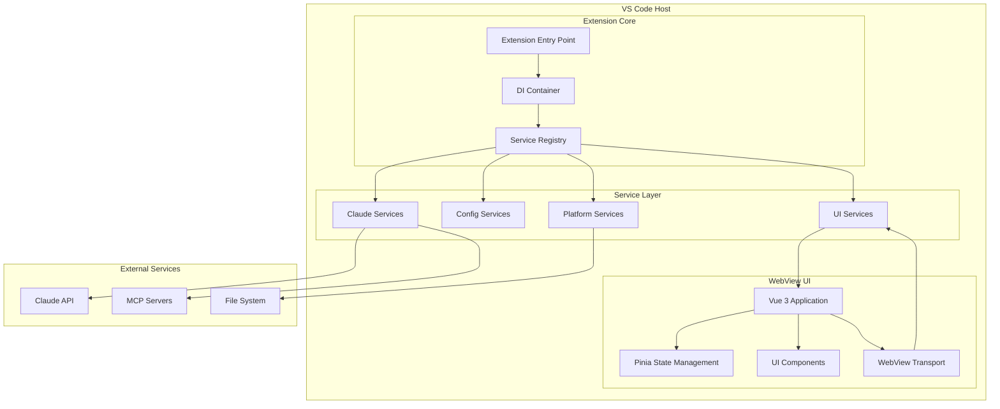
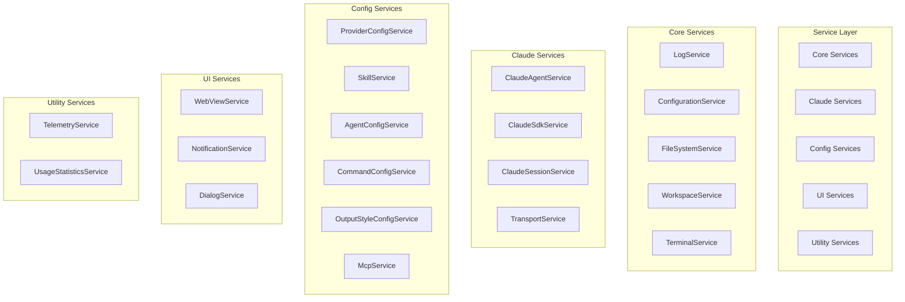
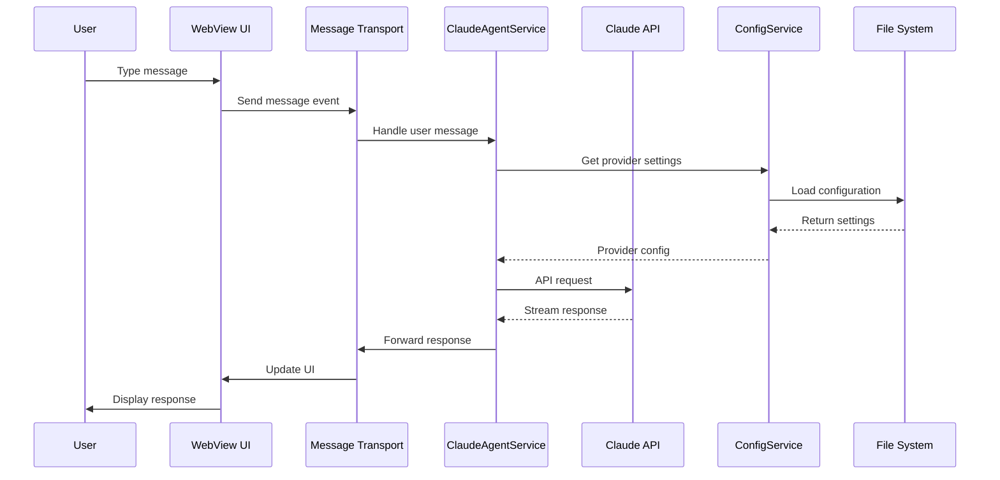
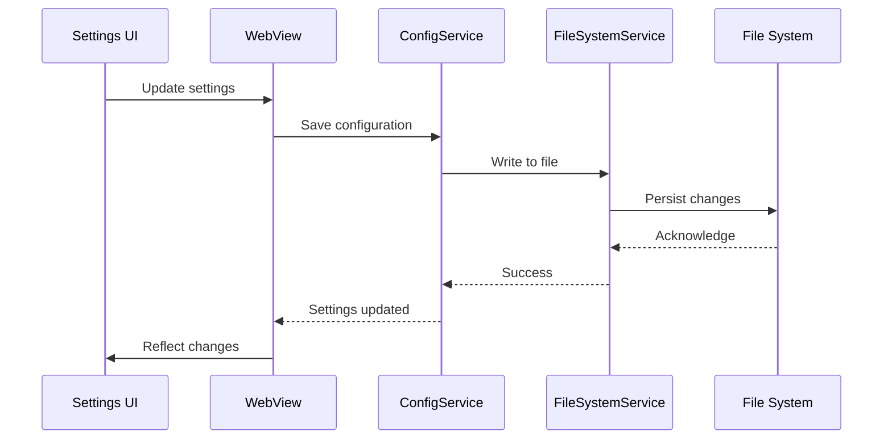
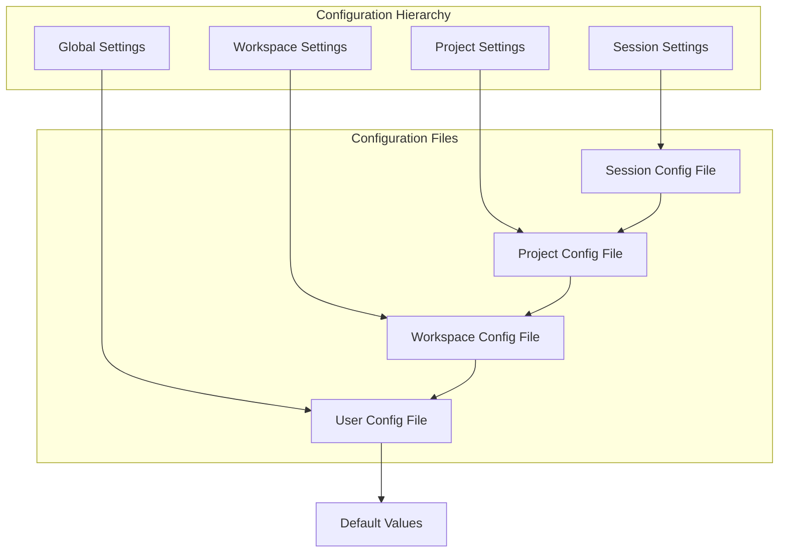
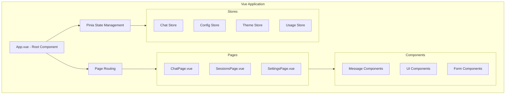

# System Architecture - CCVN (Claude Code Vietnam)

## Table of Contents
1. [Overview](#overview)
2. [High-Level Architecture](#high-level-architecture)
3. [Component Architecture](#component-architecture)
4. [Data Flow](#data-flow)
5. [Service Layer Architecture](#service-layer-architecture)
6. [Frontend Architecture](#frontend-architecture)
7. [Communication Patterns](#communication-patterns)
8. [Security Architecture](#security-architecture)
9. [Performance Architecture](#performance-architecture)
10. [Scalability Considerations](#scalability-considerations)

## Overview

CCVN (Claude Code Vietnam) is a sophisticated VS Code extension that integrates Claude Code directly into the development environment. The architecture follows a modular, service-oriented design with clear separation of concerns between the extension core, services layer, and web-based user interface.

### Key Architectural Principles

1. **Separation of Concerns**: Clear boundaries between UI, business logic, and data access
2. **Dependency Injection**: Custom DI framework for loose coupling and testability
3. **Event-Driven Architecture**: Reactive communication between components
4. **Service-Oriented Design**: Modular services with well-defined interfaces
5. **Type Safety**: Comprehensive TypeScript usage for type safety

## High-Level Architecture



## Component Architecture

### 1. Extension Core

#### Entry Point (`src/extension.ts`)
```typescript
// Main extension activation logic
export function activate(context: vscode.ExtensionContext) {
  // 1. Create DI container
  const builder = new InstantiationServiceBuilder();

  // 2. Register all services
  registerServices(builder, context);

  // 3. Build DI container
  const instantiationService = builder.seal();

  // 4. Initialize services and connections
  // ...
}
```

#### Dependency Injection Framework
The custom DI framework provides:
- Service registration and resolution
- Lifecycle management
- Dependency graph validation
- Singleton and transient service patterns

```typescript
// Service registration
builder.define(IClaudeAgentService, new SyncDescriptor(ClaudeAgentService));
builder.define(ILogService, new SyncDescriptor(LogService));

// Service injection
constructor(
  @inject(ILogService) private readonly logService: ILogService,
  @inject(IClaudeAgentService) private readonly agentService: IClaudeAgentService
) {}
```

### 2. Service Layer Architecture

#### Core Service Categories

1. **Platform Services**: VS Code API integration
2. **Claude Services**: Claude AI integration
3. **Configuration Services**: Settings and config management
4. **UI Services**: WebView and user interface management
5. **Utility Services**: Logging, telemetry, notifications

#### Service Hierarchy


## Data Flow

### 1. User Interaction Flow



### 2. Configuration Flow



## Service Layer Architecture

### 1. Claude Services Architecture

#### ClaudeAgentService
```typescript
export class ClaudeAgentService implements IClaudeAgentService {
  // Core responsibilities:
  // - Message processing and routing
  // - Session management
  // - Error handling and retry logic
  // - Response streaming

  constructor(
    private readonly transport: ITransport,
    private readonly sessionService: IClaudeSessionService,
    private readonly configService: IClaudeSettingsService
  ) {}

  async sendMessage(message: string): Promise<void> {
    // 1. Validate message
    // 2. Get current session
    // 3. Prepare message format
    // 4. Send via transport
    // 5. Handle response streaming
  }
}
```

#### Transport Layer
```typescript
// Abstract transport interface
export interface ITransport {
  send(message: ClaudeMessage): Promise<void>;
  onMessage(handler: MessageHandler): vscode.Disposable;
  isConnected(): boolean;
  connect(): Promise<void>;
  disconnect(): Promise<void>;
}

// VS Code specific implementation
export class VSCodeTransport implements ITransport {
  // Handles communication between extension and webview
  // Manages message serialization/deserialization
  // Implements connection management
}
```

### 2. Configuration Services Architecture

#### Hierarchical Configuration


#### Configuration Management
```typescript
export class ConfigurationService implements IConfigurationService {
  // Multi-layer configuration system:
  // 1. Default values
  // 2. Global user settings
  // 3. Workspace settings
  // 4. Project-specific settings
  // 5. Runtime overrides

  get<T>(key: string, defaultValue?: T): T {
    // Implements cascading configuration resolution
    return this.resolveValue(key, defaultValue);
  }

  set<T>(key: string, value: T): Promise<void> {
    // Persists to appropriate configuration layer
    return this.persistValue(key, value);
  }
}
```

## Frontend Architecture

### 1. Vue 3 Application Structure



### 2. State Management Architecture

#### Pinia Store Pattern
```typescript
// Chat store example
export const useChatStore = defineStore('chat', () => {
  // State
  const messages = ref<Message[]>([]);
  const currentSession = ref<Session | null>(null);
  const isLoading = ref(false);
  const error = ref<string | null>(null);

  // Getters
  const hasMessages = computed(() => messages.value.length > 0);
  const canSendMessage = computed(() => !isLoading.value && currentSession.value !== null);

  // Actions
  const sendMessage = async (content: string): Promise<void> => {
    // Business logic for sending messages
  };

  const clearMessages = (): void => {
    messages.value = [];
  };

  return {
    // State
    messages: readonly(messages),
    currentSession: readonly(currentSession),
    isLoading: readonly(isLoading),
    error: readonly(error),

    // Getters
    hasMessages,
    canSendMessage,

    // Actions
    sendMessage,
    clearMessages
  };
});
```

### 3. Component Architecture

#### Component Hierarchy
```
App.vue
├── ChatPage.vue
│   ├── MessageList.vue
│   │   ├── MessageItem.vue
│   │   ├── ToolExecutionBlock.vue
│   │   └── FileReferenceBlock.vue
│   ├── MessageInput.vue
│   └── ChatToolbar.vue
├── SessionsPage.vue
│   ├── SessionList.vue
│   ├── SessionItem.vue
│   └── SessionControls.vue
└── SettingsPage.vue
    ├── ProviderSettings.vue
    ├── McpSettings.vue
    ├── SkillSettings.vue
    └── UsageStatistics.vue
```

#### Component Communication
```typescript
// Parent-child communication via props and emits
<template>
  <MessageInput
    v-model="message"
    :disabled="isLoading"
    @send="handleSendMessage"
  />
</template>

// Cross-component communication via stores
const chatStore = useChatStore();
const configStore = useConfigStore();

// Provide/inject for deep component trees
provide(Symbol('chatService'), chatService);
```

## Communication Patterns

### 1. Extension-WebView Communication

#### Message Protocol
```typescript
// Standardized message format
interface WebviewMessage {
  type: string;
  payload: unknown;
  id?: string;
  timestamp?: number;
}

// Message types
enum MessageType {
  // From WebView to Extension
  SEND_MESSAGE = 'sendMessage',
  GET_PROVIDERS = 'getProviders',
  UPDATE_CONFIG = 'updateConfig',

  // From Extension to WebView
  MESSAGE_RESPONSE = 'messageResponse',
  PROVIDERS_DATA = 'providersData',
  CONFIG_UPDATED = 'configUpdated',
  ERROR = 'error'
}
```

#### Message Handling
```typescript
// Extension side
webViewService.setMessageHandler(async (message) => {
  switch (message.type) {
    case MessageType.SEND_MESSAGE:
      await claudeAgentService.sendMessage(message.payload);
      break;
    case MessageType.GET_PROVIDERS:
      const providers = await providerService.getProviders();
      webViewService.postMessage({
        type: MessageType.PROVIDERS_DATA,
        payload: providers
      });
      break;
  }
});

// WebView side
const sendMessage = (content: string): void => {
  vscodeApi.postMessage({
    type: MessageType.SEND_MESSAGE,
    payload: { content }
  });
};
```

### 2. Service Communication

#### Event-Driven Pattern
```typescript
// Event emitter for service communication
export class EventEmitter<T = any> {
  private listeners = new Map<string, Set<Function>>();

  on(event: string, listener: (data: T) => void): vscode.Disposable {
    if (!this.listeners.has(event)) {
      this.listeners.set(event, new Set());
    }
    this.listeners.get(event)!.add(listener);

    return new vscode.Disposable(() => {
      this.listeners.get(event)?.delete(listener);
    });
  }

  emit(event: string, data: T): void {
    this.listeners.get(event)?.forEach(listener => listener(data));
  }
}

// Usage in services
export class ConfigurationService {
  private readonly _onDidChange = new EventEmitter<ConfigurationChangeEvent>();

  readonly onDidChange = this._onDidChange.event;

  set(key: string, value: any): void {
    // Update configuration
    this._onDidChange.emit({ key, value });
  }
}
```

## Security Architecture

### 1. Credential Management

#### Secure Storage Pattern
```typescript
export class SecureStorageService {
  private readonly secretStorage: vscode.SecretStorage;

  async storeApiKey(providerId: string, apiKey: string): Promise<void> {
    // Store API key in VS Code's secure storage
    const key = `claude.provider.${providerId}.apikey`;
    await this.secretStorage.store(key, apiKey);
  }

  async getApiKey(providerId: string): Promise<string | undefined> {
    const key = `claude.provider.${providerId}.apikey`;
    return await this.secretStorage.get(key);
  }

  async deleteApiKey(providerId: string): Promise<void> {
    const key = `claude.provider.${providerId}.apikey`;
    await this.secretStorage.delete(key);
  }
}
```

#### Permission System
```typescript
export class PermissionManager {
  private readonly permissions = new Map<string, PermissionSet>();

  async checkPermission(toolName: string, operation: string): Promise<boolean> {
    const permissions = await this.getPermissions(toolName);
    return permissions.allow.includes(operation) &&
           !permissions.deny.includes(operation);
  }

  async grantPermission(toolName: string, operation: string): Promise<void> {
    const permissions = await this.getPermissions(toolName);
    permissions.allow.push(operation);
    await this.savePermissions(toolName, permissions);
  }
}
```

### 2. Data Protection

#### Environment Variable Isolation
```typescript
export class EnvironmentManager {
  async createIsolatedEnvironment(provider: ClaudeProvider): Promise<Record<string, string>> {
    const baseEnv = { ...process.env };
    const providerEnv: Record<string, string> = {};

    // Add provider-specific environment variables
    if (provider.settingsConfig.env.ANTHROPIC_AUTH_TOKEN) {
      providerEnv.ANTHROPIC_AUTH_TOKEN = provider.settingsConfig.env.ANTHROPIC_AUTH_TOKEN;
    }

    if (provider.settingsConfig.env.ANTHROPIC_BASE_URL) {
      providerEnv.ANTHROPIC_BASE_URL = provider.settingsConfig.env.ANTHROPIC_BASE_URL;
    }

    return { ...baseEnv, ...providerEnv };
  }
}
```

## Performance Architecture

### 1. Streaming Architecture

#### Response Streaming
```typescript
export class StreamingResponseHandler {
  async handleStreamResponse(
    response: AsyncIterable<StreamChunk>,
    onUpdate: (chunk: StreamChunk) => void
  ): Promise<string> {
    let fullResponse = '';

    for await (const chunk of response) {
      fullResponse += chunk.content;
      onUpdate(chunk);
    }

    return fullResponse;
  }
}
```

#### Message Queuing
```typescript
export class MessageQueue {
  private queue = new QueuedMessage[];
  private processing = false;

  async enqueue(message: QueuedMessage): Promise<void> {
    this.queue.push(message);
    if (!this.processing) {
      this.processQueue();
    }
  }

  private async processQueue(): Promise<void> {
    this.processing = true;

    while (this.queue.length > 0) {
      const message = this.queue.shift()!;
      try {
        await this.processMessage(message);
      } catch (error) {
        console.error('Failed to process message:', error);
      }
    }

    this.processing = false;
  }
}
```

### 2. Resource Management

#### Memory Optimization
```typescript
export class MemoryManager {
  private readonly maxMessageHistory = 1000;
  private readonly cleanupThreshold = 0.8; // 80% of limit

  async checkMemoryUsage(): Promise<void> {
    const messages = await this.getMessageCount();

    if (messages > this.maxMessageHistory * this.cleanupThreshold) {
      await this.cleanupOldMessages();
    }
  }

  private async cleanupOldMessages(): Promise<void> {
    // Remove oldest messages beyond limit
    const excess = await this.getMessageCount() - this.maxMessageHistory;
    await this.removeOldestMessages(excess);
  }
}
```

#### Performance Monitoring
```typescript
export class PerformanceMonitor {
  private metrics = new Map<string, PerformanceMetric>();

  startTimer(operation: string): () => void {
    const startTime = performance.now();

    return () => {
      const duration = performance.now() - startTime;
      this.recordMetric(operation, duration);
    };
  }

  private recordMetric(operation: string, duration: number): void {
    if (!this.metrics.has(operation)) {
      this.metrics.set(operation, {
        count: 0,
        totalTime: 0,
        averageTime: 0
      });
    }

    const metric = this.metrics.get(operation)!;
    metric.count++;
    metric.totalTime += duration;
    metric.averageTime = metric.totalTime / metric.count;
  }
}
```

## Scalability Considerations

### 1. Service Scaling

#### Service Lifecycle Management
```typescript
export class ServiceManager {
  private services = new Map<string, IService>();
  private serviceStates = new Map<string, ServiceState>();

  async startService(serviceId: string): Promise<void> {
    const service = this.services.get(serviceId);
    if (!service || this.serviceStates.get(serviceId) !== ServiceState.Stopped) {
      return;
    }

    this.serviceStates.set(serviceId, ServiceState.Starting);

    try {
      await service.start();
      this.serviceStates.set(serviceId, ServiceState.Running);
    } catch (error) {
      this.serviceStates.set(serviceId, ServiceState.Error);
      throw error;
    }
  }

  async stopService(serviceId: string): Promise<void> {
    const service = this.services.get(serviceId);
    if (!service || this.serviceStates.get(serviceId) !== ServiceState.Running) {
      return;
    }

    this.serviceStates.set(serviceId, ServiceState.Stopping);
    await service.stop();
    this.serviceStates.set(serviceId, ServiceState.Stopped);
  }
}
```

### 2. Configuration Scalability

#### Configuration Partitioning
```typescript
export class ConfigurationPartitioner {
  private partitions = new Map<string, ConfigurationPartition>();

  getPartition(category: string): ConfigurationPartition {
    if (!this.partitions.has(category)) {
      this.partitions.set(category, new ConfigurationPartition(category));
    }

    return this.partitions.get(category)!;
  }

  async loadPartition(category: string): Promise<void> {
    const partition = this.getPartition(category);
    await partition.load();
  }

  async savePartition(category: string): Promise<void> {
    const partition = this.getPartition(category);
    await partition.save();
  }
}
```

### 3. Future Scalability

#### Plugin Architecture
```typescript
export interface Plugin {
  id: string;
  name: string;
  version: string;
  activate(context: PluginContext): void;
  deactivate(): void;
}

export class PluginManager {
  private plugins = new Map<string, Plugin>();
  private contexts = new Map<string, PluginContext>();

  async loadPlugin(pluginPath: string): Promise<void> {
    const plugin = await import(pluginPath);
    const context = this.createPluginContext(plugin);

    plugin.activate(context);

    this.plugins.set(plugin.id, plugin);
    this.contexts.set(plugin.id, context);
  }
}
```

This architecture provides a solid foundation for the CCVN extension, ensuring maintainability, scalability, and high performance while maintaining clear separation of concerns and strong type safety throughout the codebase.